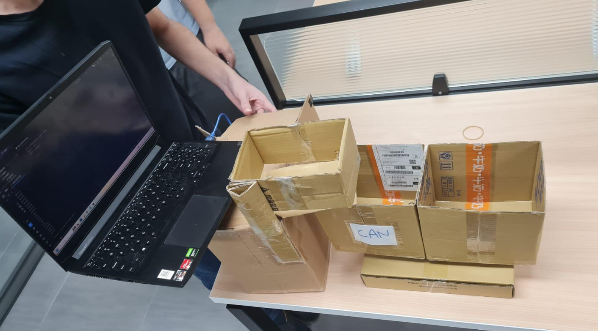

# Smart Trashcan

A trashcan that recognizes what you throw in and sorts it for you. A camera and a YOLOv8 model decide if the item is a **can** or a **plastic bottle**, then an Arduino turns the base toward the right bin and opens the door to drop it in.

## Demo

<!-- To play the video inline: edit this README on github.com, delete the line below, and drag demo_video.mp4 into the editor. GitHub will insert a playable video link. -->
https://github.com/user-attachments/assets/06d290a4-9a7a-48cc-b8d8-321028cc64f9

  

## How it works

1. You put an item into the trashcan.
2. The camera sends frames to `lazy_trashcan.py`, which runs a custom-trained YOLOv8 model (`best_2.pt`).
3. When a can or a bottle is detected, the script sends `1` (can) or `2` (bottle) to the Arduino over serial.
4. The Arduino (`Trashcan_v2.ino`) turns the base servo until the right bin is reached.
5. The door servo opens to drop the item, then closes again.

## Hardware

- Arduino Uno
- 2× MG996R servo motors (base rotation + door)
- Notebook camera
- Breadboard

## Software

- Arduino IDE
- Python with [Ultralytics YOLOv8](https://github.com/ultralytics/ultralytics), OpenCV and pySerial
- Roboflow (dataset and training)

## Files

| File | Description |
| --- | --- |
| `lazy_trashcan.py` | Camera capture, YOLOv8 inference and serial output to the Arduino |
| `Trashcan_v2.ino` | Servo control for the base and the door |
| `best_2.pt` | Trained YOLOv8 model weights (can / bottle) |
| `Group2_Report.pdf` | Project report |
| `Group2_PresentationFinal.pdf` | Final presentation slides |

## Running it

1. Upload `Trashcan_v2.ino` to the Arduino Uno (base servo on pin 8, door servo on pin 9).
2. Install the Python packages: `pip install ultralytics opencv-python pyserial`
3. Set the correct serial port in `lazy_trashcan.py` (default `COM6`).
4. Run `python lazy_trashcan.py`. Press `q` to quit.
